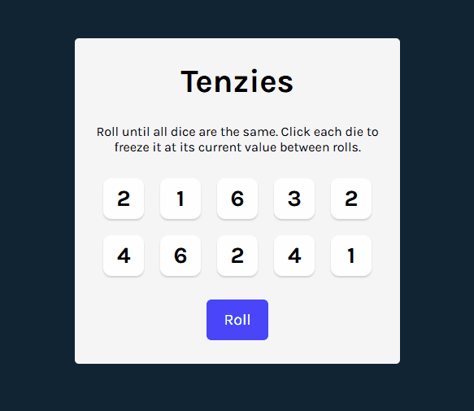

# 🎲 Tenzies Game

A simple React-based dice game where the goal is to roll all dice to show the same number. This project was built as a learning exercise to practice React fundamentals and improve accessibility and UI behavior. Capstone Project of the Learn React Course on Scrimba.com

## ⚙️ Features

- Roll 10 dice and hold specific ones to keep their values.
- Detects when all dice are held and show the same value to declare a win.
- Allows restarting the game after winning.

## 🧠 Concepts and Skills Applied

### 🔧 React Fundamentals

- `useState`: Used to manage dice values and held status.
- _Props and Component Design_: Created a reusable component that receives value, hold status, and click behavior as props.
- `useRef`: Used to access the underlying DOM node of the roll button so it can be focused when the player wins the game.
- `useEffect`: Used to synchronize the application state with an external system (the DOM) by calling `.focus()` on the button when gameWon becomes true. This ensures accessibility and a better user experience.

### 🔄 Logic and Conditional Rendering

- Dice update only if they’re not held.
- UI updates depending on whether the player has won or not.

### 🆔 Unique Keys

- Each die is given a unique ID using the `nanoid` package to ensure stable list rendering.

### 🎉 Animation

- Used the `react-confetti` package to show a simple celebration effect when the game is won.

### ♿ Accessibility

- **ARIA attributes**: Added `aria-label` and `aria-pressed` to dice buttons for screen reader support.
- **Live Region**: Used `aria-live="polite"` to notify screen reader users about game status changes.
- **Focus Management**: Used `useRef` and `useEffect` to shift focus to the "New Game" button when the game is won.

## 🕹️ How to Play

1. Click "Roll" to randomize dice.
2. Click individual dice to hold their values.
3. Try to get all dice to show the same number.
4. When you win, click "New Game" to start again.

## 🖼️ Screenshot

